# 🏗️ BuildBridge

> **A Full-Stack Construction Site & Contractor Workflow Management System** built using **Spring Boot, Spring Security, JWT, MySQL, HTML, CSS, Bootstrap, JavaScript, and REST APIs.**

---

# 📖 Project Overview

BuildBridge is a web-based **Construction Site & Contractor Workflow Management System** designed to simplify and digitize construction project management.

The system provides a centralized platform where administrators, supervisors, contractors, and clients can collaborate efficiently. It enables secure authentication, project monitoring, contractor assignment, inquiry management, daily work logging, and role-based access through a scalable full-stack architecture.

The backend is developed using **Spring Boot** with **REST APIs**, while the frontend is built using **HTML, CSS, Bootstrap, and JavaScript**. Data is securely stored in **MySQL** using **Spring Data JPA**.

---

# ❓ Problem Statement

Managing construction projects manually often leads to:

- Poor communication between stakeholders
- Difficulty tracking construction tasks
- Inefficient contractor assignment
- Lack of centralized project information
- Delays in monitoring work progress
- Difficulty handling customer inquiries
- Manual maintenance of work logs

A digital platform is required to streamline these operations and improve collaboration across all stakeholders.

---

# 💡 Solution

BuildBridge provides a centralized platform that enables:

- Secure role-based login
- Contractor assignment
- Construction task management
- Daily work log tracking
- Customer inquiry management
- Supervisor monitoring dashboard
- REST API communication
- Centralized project information

The system improves productivity, transparency, and project monitoring while reducing manual work.

---

# ✨ Features

## 🔐 Authentication & Authorization

- Secure Login & Registration
- JWT Authentication
- Spring Security Integration
- Role-Based Access Control

---

## 👨‍💼 Admin Module

- Manage Users
- View Project Information
- Monitor System Activities
- Handle Customer Inquiries

---

## 👷 Contractor Module

- View Assigned Projects
- Track Construction Tasks
- Update Work Progress
- Submit Daily Work Logs

---

## 👨‍🔧 Supervisor Module

- Assign Contractors
- Monitor Projects
- Review Work Logs
- Track Construction Progress

---

## 👤 Client Module

- View Assigned Projects
- Submit Inquiries
- Track Inquiry Status

---

## 🏗️ Construction Task Management

- Create Tasks
- Update Tasks
- Delete Tasks
- Assign Priorities
- Track Status

---

## 📋 Daily Work Logs

- Record Daily Activities
- Maintain Work History
- Improve Transparency

---

## 📨 Inquiry Management

- Raise Project Inquiries
- Track Inquiry Status
- Manage Customer Communication

---

## 🌐 REST APIs

- Layered Spring Boot Architecture
- CRUD Operations
- JSON Responses
- Tested using Postman

---

## 💾 Database Integration

- MySQL Database
- Spring Data JPA
- Repository Pattern
- Secure Data Persistence

---

# 🛠️ Tech Stack

| Technology | Purpose |
|------------|---------|
| Java | Backend Development |
| Spring Boot | REST API Development |
| Spring Security | Authentication & Authorization |
| JWT | Secure Token Authentication |
| Spring Data JPA | Database Operations |
| MySQL | Database |
| HTML5 | Frontend Structure |
| CSS3 | Styling |
| Bootstrap | Responsive UI |
| JavaScript | Dynamic Functionality |
| REST APIs | Frontend-Backend Communication |
| Maven | Dependency Management |
| Git | Version Control |
| GitHub | Project Hosting |
| Postman | API Testing |

---

# 📂 Project Structure

```
BuildBridge
│
├── backend
│   ├── src
│   ├── pom.xml
│   └── ...
│
├── frontend
│   ├── css
│   ├── js
│   ├── login.html
│   ├── register.html
│   ├── dashboard-admin.html
│   ├── dashboard-supervisor.html
│   ├── dashboard-contractor.html
│   ├── dashboard-client.html
│   └── ...
│
├── frontend-react
│   └── Initial React Prototype
│
├── screenshots
│
├── README.md
│
└── .gitignore
```

---

# 🏛️ System Architecture

```
                   User
                     │
                     ▼
        HTML • CSS • Bootstrap
                     │
              JavaScript
                     │
               REST APIs
                     │
          Spring Boot Backend
                     │
        Controller Layer
                     │
         Service Layer
                     │
      Repository Layer (JPA)
                     │
              MySQL Database
```

The application follows a **Layered Architecture** that separates presentation, business logic, and data access, making the project scalable, maintainable, and easy to extend.

---

# 🔄 Project Workflow

1. User logs into the application.
2. Spring Security authenticates the user.
3. JWT Token is generated.
4. Frontend communicates with REST APIs.
5. Controllers receive requests.
6. Services execute business logic.
7. Repositories interact with MySQL.
8. Data is returned as JSON.
9. Frontend displays the response.

---

# 📈 Current Implementation Status

- ✅ Secure Authentication
- ✅ JWT Authorization
- ✅ Role-Based Access
- ✅ Contractor Management
- ✅ Supervisor Module
- ✅ Client Module
- ✅ Task Management
- ✅ Inquiry Management
- ✅ Daily Work Logs
- ✅ REST APIs
- ✅ MySQL Integration
- ✅ Responsive Frontend

---

# ⚙️ Installation Guide

## Clone Repository

```bash
git clone https://github.com/shreenithisethubalu13/BuildBridge.git
```

---

## Backend Setup

```bash
cd backend
```

Configure MySQL credentials inside:

```
src/main/resources/application.properties
```

Run the Spring Boot application.

---

## Frontend Setup

Open the **frontend** folder.

Run:

```
login.html
```

using **Live Server** or any web browser.

---

## Database

Create a MySQL database.

Update:

```
backend/src/main/resources/application.properties
```

Then start the backend server.

---

# 🔌 REST API Modules

The backend exposes APIs for:

- Authentication
- User Management
- Contractor Management
- Supervisor Module
- Assignment Module
- Construction Tasks
- Daily Work Logs
- Project Inquiries

All APIs were tested using **Postman**.

---

# 📸 Screenshots

## 🔐 Login Page

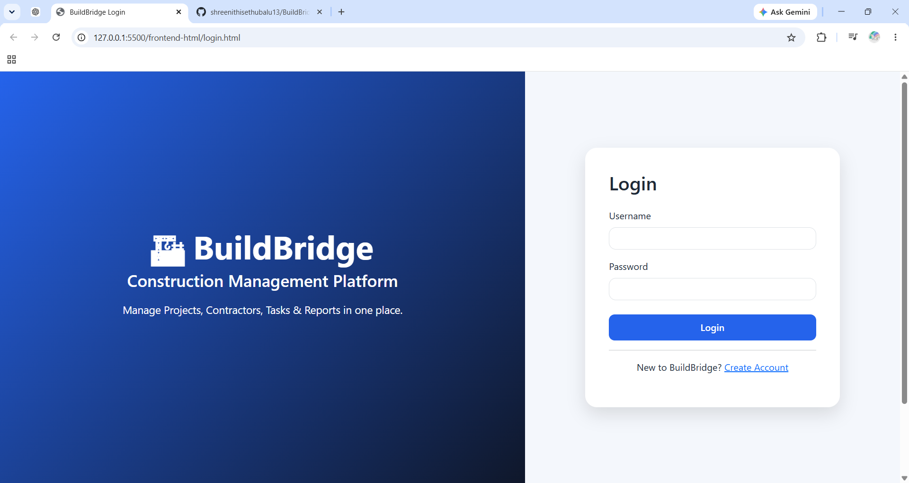

---

## 📝 Register Page

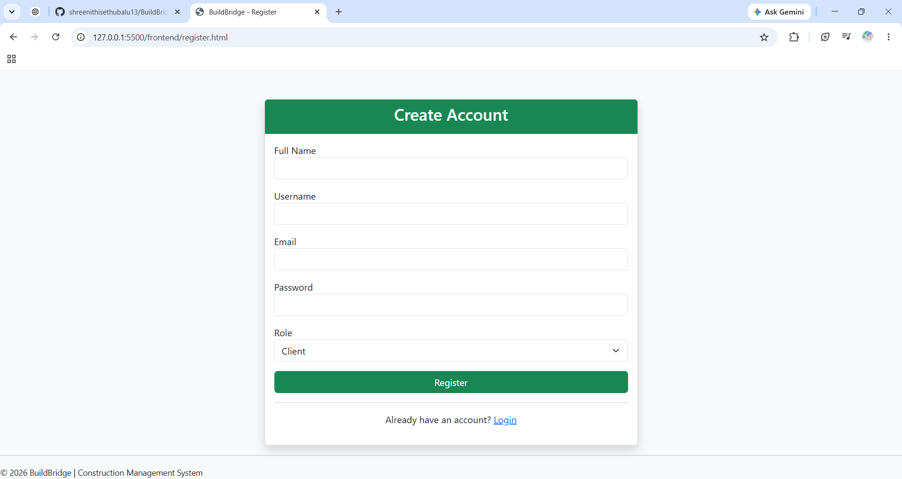

---

## 👨‍💼 Admin Dashboard

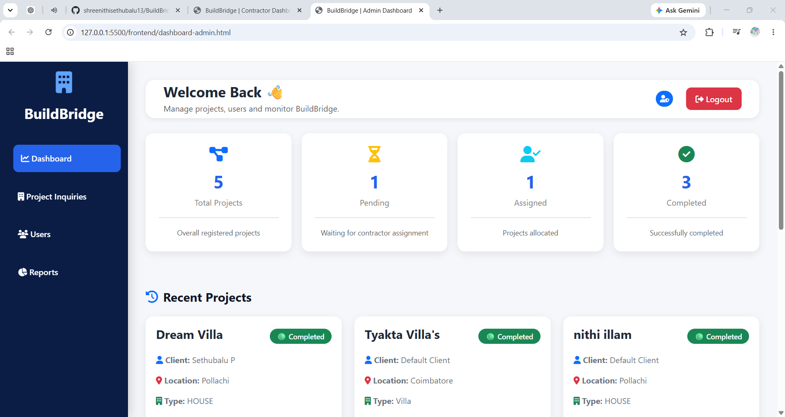

---

## 👨‍🔧 Supervisor Dashboard

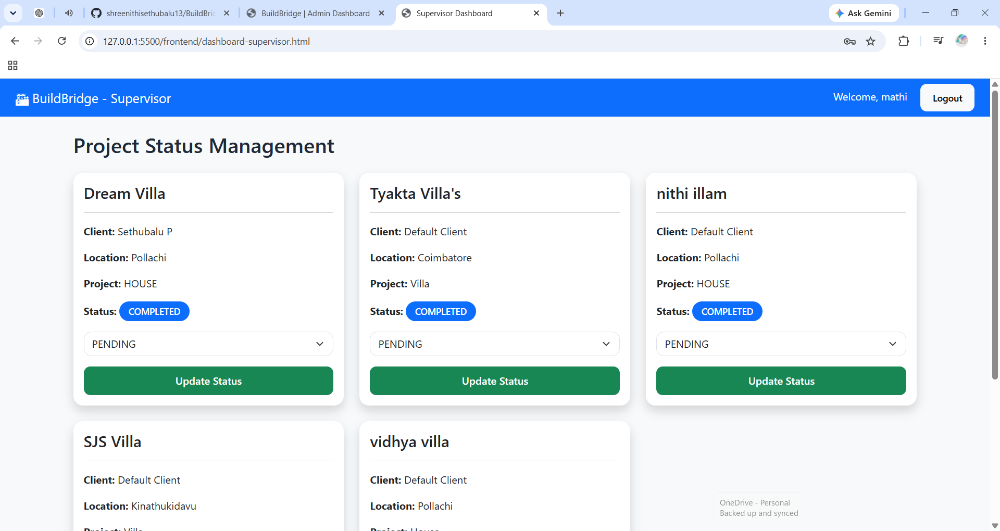

---

## 👷 Contractor Dashboard

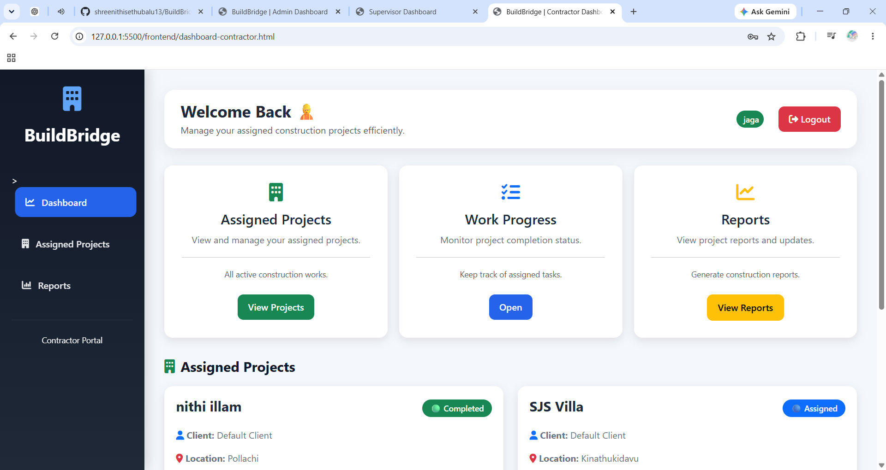

---

## 👤 Client Dashboard

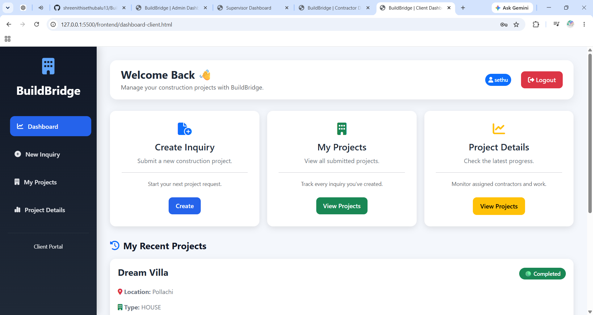

---

## 🏗️ Project Sites

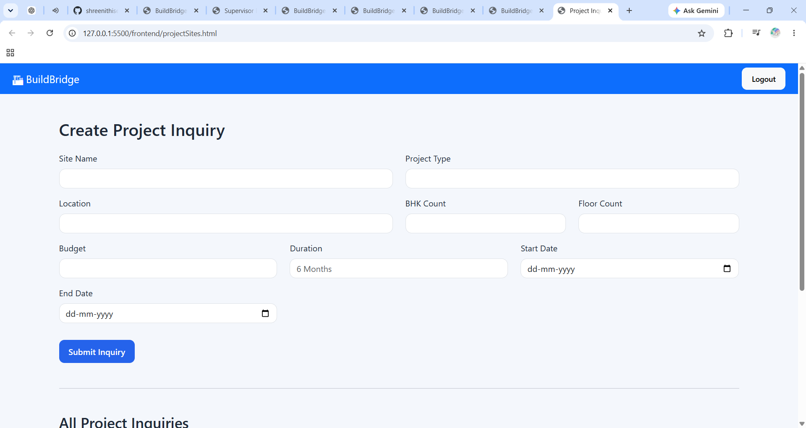

---

## 👥 User Management

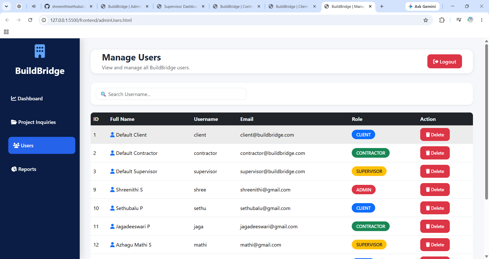

---

## 📨 Inquiry Management

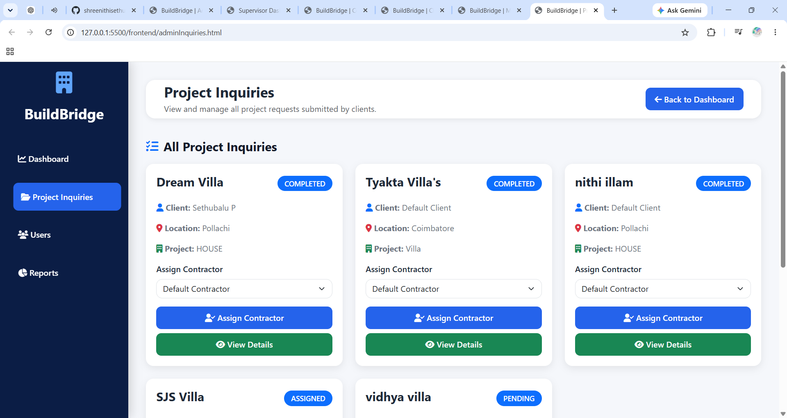

---

## 📋 My Inquiries

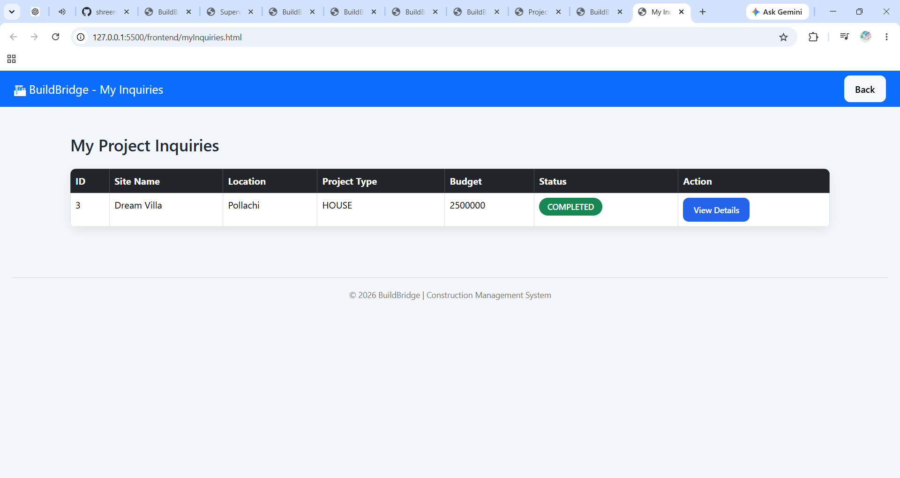

---

## 📊 Reports Dashboard

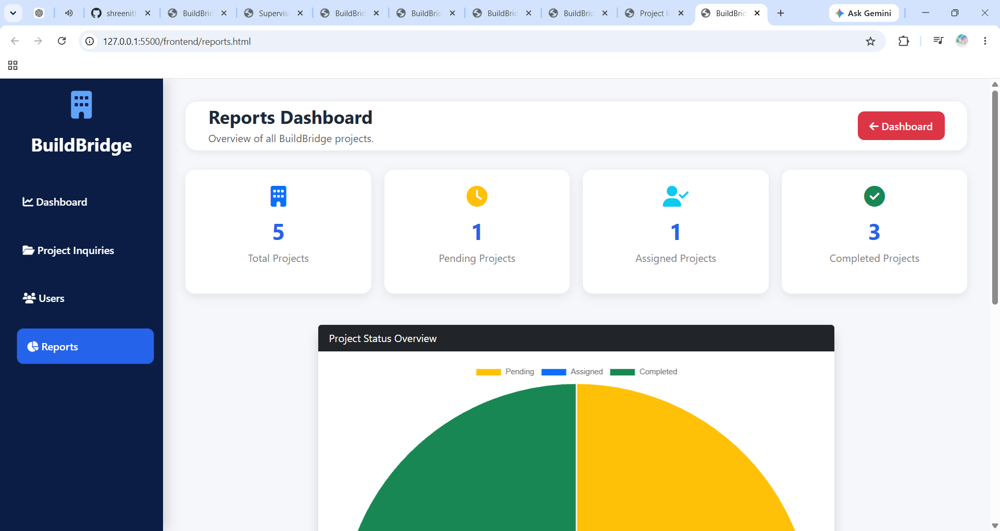

---

# 🚀 Future Enhancements

- Docker Containerization
- Cloud Deployment (AWS/Azure)
- CI/CD Pipeline
- Email Notifications
- File Upload Support
- Project Report Generation (PDF/Excel)
- Mobile Application
- Real-Time Chat
- Push Notifications
- AI-Based Project Progress Prediction
- Analytics Dashboard

---

# 👩‍💻 Developer

## Shreenithi S

**B.Tech – Artificial Intelligence & Data Science**

**Dr. Mahalingam College of Engineering and Technology**

Passionate about **Backend Development**, **Java Spring Boot**, **REST API Development**, **Full-Stack Web Development**, and building scalable real-world software solutions.

---

## 🤝 Contributing

Contributions, suggestions, and improvements are always welcome.

If you'd like to contribute:

1. Fork the repository.
2. Create a new feature branch.
3. Commit your changes.
4. Submit a Pull Request.

---

## ⭐ Support

If you found this project useful, consider giving it a ⭐ on GitHub.

It motivates me to continue building and sharing more real-world projects.

---

## 📬 Connect with Me

- GitHub: **github.com/shreenithisethubalu13**
- LinkedIn: **www.linkedin.com/in/shreenithi-s**